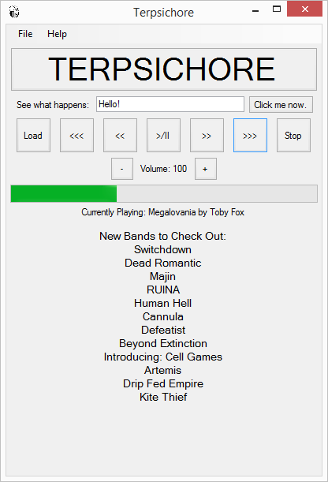

Terpsichore
===========

**This cross-platform app was generated by** `Briefcase`_ **- part of**
`The BeeWare Project`_. **If you want to see more tools like Briefcase, please
consider** `becoming a financial member of BeeWare`_.

BeeWare the Python Music Player!

.. _`Briefcase`: https://github.com/beeware/briefcase
.. _`The BeeWare Project`: https://beeware.org/
.. _`becoming a financial member of BeeWare`: https://beeware.org/contributing/membership

Description
===========

This app lets you load up mp3s, and play them.  You can fastforward, rewind, stop, etc.  It's a very simple music player, however, it also scrapes the website `Gig Radar`_ for new bands using Beautiful Soup!

.. _`Gig Radar`: https://gigradar.co.uk/category/new-band-of-the-week/

Dependencies
============

* Python 3.8 (has not been tested above or below this version).  Modules required are briefcase, toga, pygame, os, threading, time, eyed3, bs4, requests and re.
* Windows 10 (has not been tested on macOS, Linux, or iOS, known not to work on Android).
* Building BeeWare on Windows requires `Git`_ and `WiX Toolset`_.

.. _`Git`: https://git-scm.com/download/
.. _`WiX Toolset`: https://wixtoolset.org/releases/

Installing
==========

* You can download the code from the Terpsichore repository by clicking "Code", then "Download ZIP".
* Please read the BeeWare `docs`_ for guidance on how to install.

.. _`docs`: https://docs.beeware.org/en/latest/

Executing the program
=====================

* Click me now: This will provide a pop up parroting what you typed in the text box.  How you will use this is up to you.
* Load: Load an mp3 from your computer.
* <<<: Super-rewind (10 seconds), you need to keep clicking it, but it rewinds faster than <<<.
* <<: Rewind (5 seconds), you need to keep clicking it, it is a rewind of 5 seconds per click.
* >/=: This is a pause and play toggle.
* >>: Fastforward (5 seconds), you need to keep clicking it, it fastforwards by 5 seconds per click.
* >>>: Super-fastforward (10 seconds), you need to keep clicking it, it fastforwards by 10 seconds per click.
* Stop: This stops the music, and returns the song back to the start, no longer playing.
* Volume: Click the - or + buttons if you want the sound to be louder or quieter respectively.
* New Bands to Check Out: This will deplay the 10 latest bands from `Gig Radar`_.

Authors
=======

Marc Jowett (carkzis.apps@gmail.com)

Version History
===============

* 0.1 - Initial Release. Only works on Windows currently, and not on Android due to the pygame dependency.
  
License
=======

This is licensed under the BSD-3-Clause License.  You can see the LICENSE.md for further details.

Acknowledgments
===============
* `Gig Radar`_
* `Russell Keith-Magee et al`_

.. _`Russell Keith-Magee et al`: https://docs.beeware.org/
